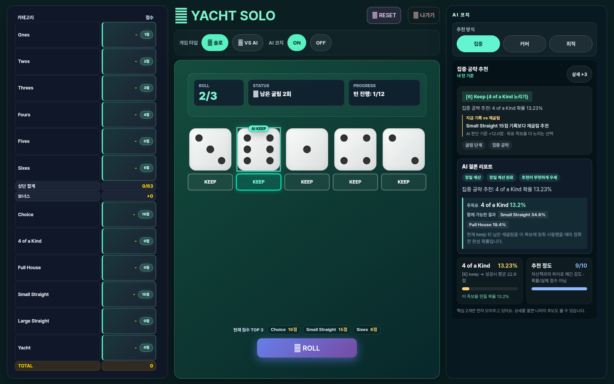

# YACHT — 주사위는 운, 선택은 전략

5개의 주사위를 최대 세 번 굴리고, 12개 족보를 한 번씩 채우는 웹 요트 다이스 게임입니다. 혼자 점수를 노리거나 AI와 겨루고, 친구와 실시간 1:1 대전·관전도 할 수 있습니다.

[바로 플레이하기](https://yatch-game.cloud/) · [게임 소개](https://yatch-game.cloud/intro) · [API 문서](./API.md)



## 화면 구성

- **넓은 PC 화면(1201px 이상)** — 게임을 열면 자동으로 테이블 보기를 사용합니다. 왼쪽 점수판, 가운데 주사위와 ROLL, 오른쪽 AI 코치를 한 화면에 두어 현재 선택과 점수 흐름을 함께 볼 수 있습니다. `↔ 기본`으로 기존 보기를 선택하면 그 선택을 기억합니다.
- **모바일** — 기존의 세로 흐름을 유지합니다. 주사위를 먼저 보고 점수판과 추천을 아래에서 차례로 확인하므로 작은 화면에서도 조작이 빽빽해지지 않습니다.
- **점수판** — 상단 족보 합계는 `현재 점수/63`, 보너스는 `+0` 또는 획득 점수로 표시합니다. 족보 이름에 마우스를 올리면 해당 족보의 점수 규칙을 볼 수 있습니다.

데스크톱에서 `현재 점수 TOP 3`는 이번 주사위로 바로 기록할 수 있는 높은 점수 후보를 보여줍니다. 최종 선택은 항상 플레이어가 하며, 모바일에서는 공간을 위해 이 요약을 숨깁니다.

## 한 턴은 이렇게 합니다

1. **ROLL** — 5개 주사위를 굴립니다. 한 턴에는 최대 세 번까지 굴릴 수 있습니다.
2. **KEEP 또는 재굴림** — 남길 주사위를 눌러 고정하고, 나머지만 다시 굴립니다.
3. **점수 기록** — 빈 족보 하나를 골라 이번 주사위를 기록합니다. 점수판의 `지금 N점`은 그 칸을 바로 선택했을 때의 점수입니다.

### 잘 안 풀린 턴도 선택입니다

모든 족보는 게임당 한 번만 기록할 수 있습니다. 조건을 만족하지 못한 족보에 **0점으로 기록하면 그 칸은 닫히고**, 대신 다른 중요한 족보를 다음 턴까지 남길 수 있습니다. 이것이 흔히 말하는 “이번 턴을 버린다”는 판단입니다.

예를 들어 남은 굴림이 없고 Full House가 불가능하다면, Full House를 0점으로 닫아 Sixes나 Large Straight 같은 더 중요한 칸을 보존할 수 있습니다. 다만 Yacht·Large Straight처럼 고점 족보를 너무 이르게 0점 처리하면 후반 선택지가 크게 줄어듭니다.

> 0점은 실수가 아니라 선택지입니다. 다만 한 번 기록하면 되돌릴 수 없으니, 점수판에 남은 칸과 상단 보너스 진행도를 함께 보세요.

## AI 코치

AI 코치는 자동으로 플레이하지 않습니다. KEEP할 주사위와 기록 후보를 보여 주지만, 최종 선택은 항상 플레이어가 합니다. 추천은 항상 exact solver로 계산합니다.

| 모드 | 이럴 때 쓰세요 | 무엇을 우선하나요 |
| --- | --- | --- |
| **집중** | 한 족보를 끝까지 노리고 싶을 때 | 지금 가장 유망한 한 목표 |
| **커버** | 여러 가능성을 남기고 싶을 때 | 하나 이상 성공할 확률 |
| **최적** | 최종 기대점수를 최대화하고 싶을 때 | 남은 점수판까지 포함한 기대값 |

추천 패널은 KEEP할 주사위, 추천 또는 희생 점수칸, 그리고 간단한 근거를 보여줍니다. 처음에는 **집중** 모드로 시작하면 이해하기 편합니다.

## 플레이 모드

- **솔로** — 내 최고 점수에 도전합니다. AI 코치를 끄면 서버 검증 랭킹 기록으로 플레이할 수 있습니다.
- **VS AI** — AI와 12턴씩 진행해 총점을 겨룹니다. 주사위, 점수, 봇 턴과 전적 저장을 서버가 처리하며 완료 전적은 로비의 VS AI 탭에서 확인할 수 있습니다.
- **실시간 멀티** — 방 코드를 공유해 친구와 1:1로 플레이합니다. 관전자 입장과 재대결도 지원합니다.
- **관전** — 방에 들어가 경기 흐름과 점수판을 읽기 전용으로 봅니다.

VS AI와 멀티플레이의 주사위·점수는 서버가 판정합니다. 멀티플레이는 실시간 이벤트와 polling fallback으로 동기화됩니다.

## 실행하기

```bash
python3 -m venv .venv
. .venv/bin/activate
pip install -r requirements.txt
python3 server.py
```

브라우저에서 `http://localhost:8080`을 엽니다.

화면 크기에 따라 게임 화면은 자동으로 전환됩니다. 1201px 이상에서는 `/game/single/table`, `/game/multi/table` 테이블 보기를 기본으로 사용하고, 그보다 좁은 화면에서는 `/game/single`, `/game/multi` 기존 보기를 사용합니다.

운영 환경에서는 Gunicorn을 사용할 수 있습니다.

```bash
gunicorn -c gunicorn.conf.py wsgi:application
```

## 구현 원칙

추천은 단순 족보 완성 확률이 아니라 현재 주사위, 남은 재굴림, 열린 점수칸, 상단 63점 보너스와 Yacht Bonus까지 함께 고려합니다. 제품 런타임은 학습 모델 선택지 없이 exact solver 하나로 동작합니다.

추천 품질은 exact solver 기준으로 검증합니다. 실험용 학습 코드와 평가 자료는 제품 경로와 분리해 `scripts/`, `artifacts/`, `docs/`에 보관합니다.

<details>
<summary>개발·운영 정보 펼치기</summary>

### 기술 구성

- Python / Flask / Vanilla JavaScript / CSS
- AI: exact value table, turn DP, decision-regret evaluation
- 기본 코치와 VS AI: exact solver

### AI 품질 지표

| 지표 | 결과 |
| --- | --- |
| 초기 상태 exact EV | 198.358185점 |
| Focused score-stage regret | 0.0000 |
| Focused 200게임 A/B | heuristic 175.52점 → value_score_only 184.56점 |
| Optimal 200게임 평균 | 198.645점 |
| AI cold-cache 응답 | heuristic 38~194ms, value-optimal 59~140ms |

상세 내용은 [AI 품질 지표](./docs/ai-quality-metrics.md), [AI 수식 설명](./docs/ai-math.md), [AI 결정 프레임워크](./docs/ai-decision-framework.md)에서 확인할 수 있습니다.

### 멀티플레이 운영 설정

기본 상태 저장은 in-memory입니다. 다중 worker나 장기 운영에는 Redis와 SQLite backend를 설정할 수 있습니다.

```bash
export YACHT_ROOM_BACKEND=redis
export YACHT_PRESENCE_BACKEND=redis
export YACHT_SESSION_BACKEND=redis
export YACHT_REDIS_URL=redis://localhost:6379/0

export YACHT_RESULT_BACKEND=sqlite
export YACHT_SQLITE_PATH=/var/lib/yacht/game_data.sqlite3
python3 server.py
```

주요 API와 요청 예시는 [API.md](./API.md)를 참고하세요. 멀티플레이는 서버 권위 주사위, 점수 재검증, commit-reveal fairness 검증을 사용합니다.

### 운영과 배포

개발 환경은 in-memory 저장소로 실행할 수 있습니다. 장기 운영이나 다중 worker 환경에서는 Redis(방·로비·세션)와 SQLite(전적)를 사용하세요. 다중 worker로 시작하면 앱이 이 구성을 확인합니다.

현재 호스팅 환경은 `yacht-hosting.sh`로 제어합니다.

```bash
bash yacht-hosting.sh status
bash yacht-hosting.sh restart 8080
curl -fsS https://yatch-game.cloud/health
```

`/health` 응답에서 `room_backend`, `presence_backend`, `session_backend`, `result_backend`를 확인할 수 있습니다.

### 검증 명령

```bash
.venv/bin/pip install -r requirements-dev.txt
.venv/bin/ruff check .
.venv/bin/python -m unittest discover -s tests
.venv/bin/python scripts/check_ai_golden.py
node --check static/js/ai_panel.js
node --check static/js/score_utils.js
```

</details>

## 더 읽기

- [게임 API](./API.md)
- [처음부터 읽는 게임 규칙·추천 전략 가이드](./docs/yacht-game-guide-and-recommendation-strategy.md)
- [변경 이력](./CHANGELOG.md)
- [승률 엔진 노트](./docs/win-probability-v1-notes.md)
- [성능 로드맵](./docs/performance-roadmap.md)
- [Artifact 관리 정책](./artifacts/README.md)

## 오픈소스 에셋과 라이선스

감정표현 SVG는 [OpenMoji](https://openmoji.org/) 17.0.0 컬러 에셋이며 [CC BY-SA 4.0](./static/assets/openmoji/LICENSE.txt)으로 제공됩니다. 이 프로젝트의 라이선스는 MIT입니다.
