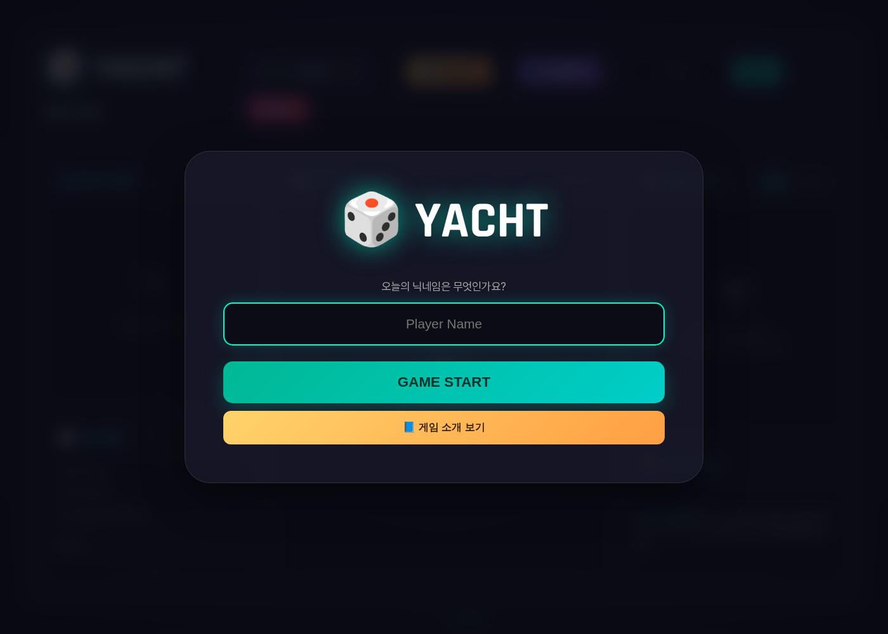
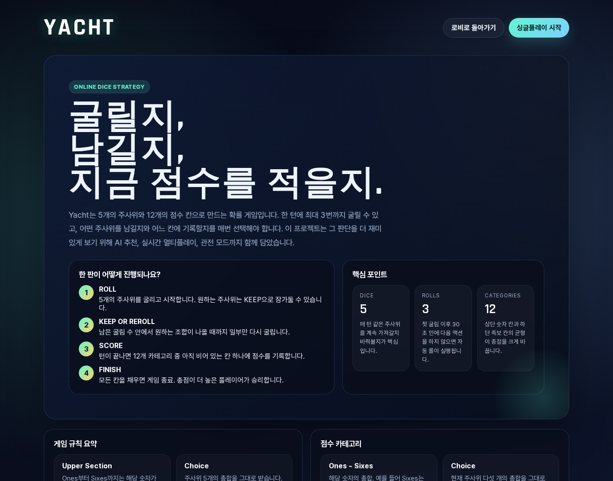
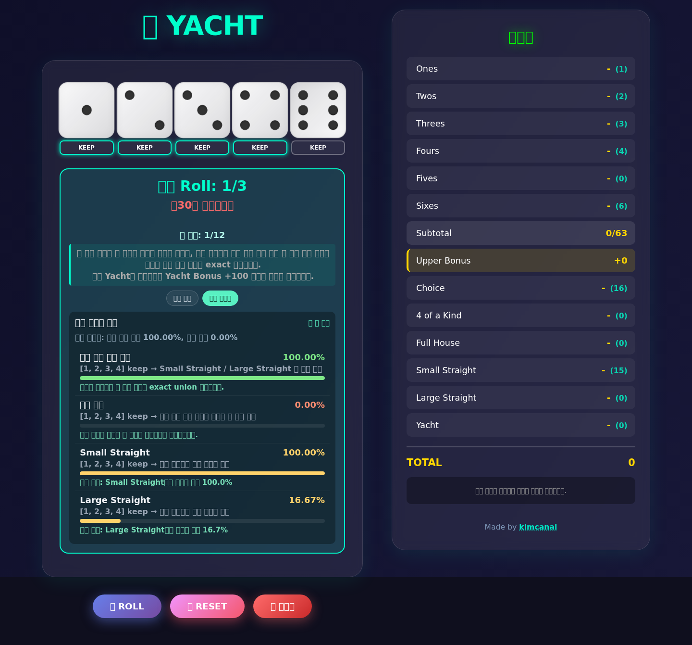
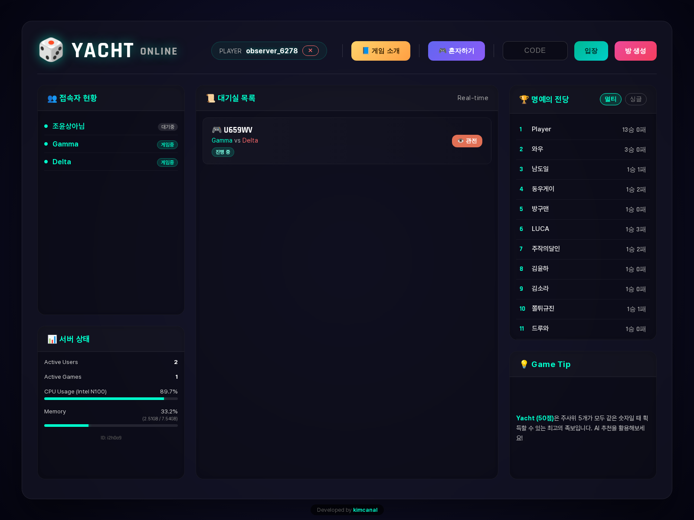

# Yacht Multi With Suggestions

Flask 기반의 웹 요트 다이스 게임입니다. 싱글플레이, VS AI, 실시간 1:1 멀티플레이, 관전, 리더보드, 방 채팅, AI 추천 코치를 제공합니다.

이 프로젝트의 핵심은 "추천을 보여주는 게임"을 넘어서, **exact solver를 기준선으로 삼고 추천 품질을 수치로 검증하는 게임 AI 시스템**을 제품 UI에 연결한 점입니다.

- Live: https://app.yatch-game.cloud/
- Stack: Python / Flask / Vanilla JavaScript / CSS
- AI 기준선: full-game exact value table, turn DP, decision-regret evaluation
- 현재 기본 코치: Focused roll policy + score-stage exact value lookup

---

## 한눈에 보기

| 영역 | 제공 기능 |
| --- | --- |
| 게임 모드 | 솔로 챌린지, VS AI, 실시간 1:1 멀티, 관전 |
| AI 코치 | Focused, Cover, Optimal 3가지 추천 모드 |
| 추천 UI | keep 주사위 하이라이트, 추천 점수칸 표시, 결정 근거 패널 |
| 멀티 안정성 | 서버 권위 주사위 굴림, 점수 재검증, commit-reveal fairness |
| 기록 | 싱글/멀티 리더보드, 최근 경기, 플레이어 전적 |
| 운영 | health/system-status API, AI latency metric, golden/regression tests |

## 화면

### 로비



### 게임 소개



### 싱글플레이 + AI 추천



### 멀티 로비 + 대기실



## 빠른 실행

```bash
python3 -m venv .venv
. .venv/bin/activate
pip install -r requirements.txt
python3 server.py
```

기본 주소는 `http://localhost:8080`입니다.

운영 환경에서는 gunicorn 설정을 사용할 수 있습니다.

```bash
gunicorn -c gunicorn.conf.py wsgi:application
```

리더보드/게임 결과 파일 경로는 필요하면 바꿀 수 있습니다.

```bash
export YACHT_DATA_FILE=/path/to/game_data.json
```

멀티 room/presence 상태는 기본적으로 in-memory backend를 사용합니다. 다중 worker나 장기 운영에서는 Redis backend를 켤 수 있습니다.

```bash
export YACHT_ROOM_BACKEND=redis
export YACHT_PRESENCE_BACKEND=redis
export YACHT_REDIS_URL=redis://localhost:6379/0
python3 server.py
```

## AI 코치

추천 엔진은 현재 주사위, 남은 reroll 수, 열린 점수칸, Upper Bonus, Yacht Bonus, 희생 칸의 장기 손실을 함께 봅니다. `/api/recommend` 응답은 `keep_indices`, `dice_recommendations`, `primary_target`, `breakdown`, `decision_report`를 내려주고, 프론트는 이를 주사위/점수판 하이라이트와 설명 패널로 표시합니다.

| 모드 | 성격 | 현재 구현 |
| --- | --- | --- |
| Focused | 기본값. 한 목표를 잡고 설명 가능한 방식으로 밀어주는 모드 | roll 단계는 focused 휴리스틱, score 단계는 `value_score_only` exact V(next_state) |
| Cover | 여러 하단 족보 중 하나 이상 성공할 가능성을 넓게 보는 모드 | exact union 확률과 실패 확률을 함께 표시 |
| Optimal | 기대 최종점수 최대화 모드 | full-game value table 기반 `value_optimal` |

### 품질 검증 수치

full-game exact value table이 있으므로 추천 품질을 이론 최적 대비로 측정할 수 있습니다.

| 지표 | 결과 |
| --- | --- |
| 초기 상태 exact EV | 198.358185점 |
| Focused score-stage regret | score 단계 exact value 승격 후 0.0000 |
| Focused 100게임 decision regret | 19.49점/게임 -> 10.39점/게임 |
| Focused 200게임 paired A/B | heuristic 175.52점 vs value_score_only 184.56점, 평균 +9.04점 |
| Optimal 200게임 평균 | 198.645점 |
| AI cold-cache 응답 | heuristic 38~194ms, value-optimal 59~140ms |

상세 지표와 개선 기록:

- [AI 추천 품질 지표 체계](./docs/ai-quality-metrics.md)
- [Score-only exact value 재검증](./docs/decision-regret-100-value-score-only.md)
- [Full-table optimal A/B](./docs/score-value-full-table-optimal-focused-200-indexed-analysis.md)
- [AI 수식 설명](./docs/ai-math.md)
- [AI 학습/실험 로드맵](./docs/ai-learning-roadmap.md)

## 멀티플레이어

멀티플레이는 방 코드로 참가하고, 관전자도 같은 방 상태를 볼 수 있습니다. 게임 종료 후에는 재대결 동의 흐름과 최근 경기/전적 기록으로 이어집니다.

중요한 신뢰 경계는 서버 쪽에 있습니다.

- 주사위는 `/api/rooms/<code>/roll`에서 서버가 생성합니다.
- `/sync`는 클라이언트가 보낸 dice 값을 신뢰하지 않습니다.
- 점수 기록은 서버가 현재 주사위와 점수판으로 다시 계산합니다.
- roll 결과는 commit-reveal fairness 상태로 검증할 수 있습니다.
- 방 채팅은 참가자/관전자 모두 사용할 수 있고, 최근 40개 메시지를 유지합니다.
- 참가자 토큰은 URL이 아니라 `X-Player-Token` 헤더 또는 POST body로만 전송합니다.
- 상태 변경은 SSE로 감지하고, 연결 실패 시 polling으로 자동 복귀합니다.

## 승률 분석

멀티 화면은 점수판별 exact value table 예상 최종점수를 즉시 표시하고, 백그라운드 Monte Carlo 결과가 준비되면 승률과 표본 오차를 갱신합니다. 양쪽 플레이어가 남은 게임을 `value_optimal` 정책으로 진행한다고 가정하며, 상태별 결과는 서버에서 캐시됩니다.

- `POST /api/win-probability`는 첫 요청에 `202 pending`을 반환하고 계산 완료 후 같은 요청에 `200 ready`를 반환합니다.
- 기본 30샘플이라 표본 오차가 넓을 수 있으며 UI에 오차 폭을 함께 표시합니다.
- 승률 최대화 정책이 아니라 양쪽 모두 EV 최적 플레이를 계속한다는 조건부 전망입니다.

- fast-path 적용 후 `samples=20, seed=1`: 46.87초 -> 2.86초
- 100샘플 재검증: 약 7.97초
- 300샘플 추정: 환경/캐시 상태에 따라 약 24~43초

자세한 설계와 한계는 [멀티플레이어 승률 v1 노트](./docs/win-probability-v1-notes.md)에 정리되어 있습니다.

## 주요 API

| API | 용도 |
| --- | --- |
| `POST /api/recommend` | AI 추천 |
| `POST /api/win-probability` | exact 기대 최종점수 + 캐시된 Monte Carlo 승률 |
| `POST /api/single/start` | 싱글 랭킹용 서버 검증 세션 시작 |
| `POST /api/single/roll` | 싱글 랭킹 세션 주사위 굴림 |
| `POST /api/single/score` | 싱글 랭킹 세션 점수 기록 |
| `GET /api/rooms` | 방 목록 |
| `POST /api/rooms` | 방 생성 |
| `POST /api/rooms/<code>/join` | 방 입장 |
| `POST /api/rooms/<code>/observe` | 관전 입장 |
| `POST /api/rooms/<code>/roll` | 서버 권위 주사위 굴림 |
| `POST /api/rooms/<code>/sync` | 멀티 상태 동기화/점수 기록 |
| `POST /api/rooms/<code>/chat` | 방 채팅 |
| `GET /api/rooms/<code>/fairness` | 현재 fairness commit/reveal 상태 |
| `POST /api/rooms/<code>/rematch` | 재대결 동의 |
| `GET /api/leaderboard/single` | 싱글 리더보드 |
| `GET /api/leaderboard/multi` | 멀티 리더보드 |
| `GET /api/leaderboard/recent` | 최근 경기 |
| `GET /health` | 헬스 체크 |
| `GET /api/system-status` | 운영 상태와 AI 메트릭 |

요청/응답 예시는 [API.md](./API.md)를 참고하세요.

## 검증 명령

```bash
.venv/bin/python -m unittest discover -s tests
.venv/bin/python scripts/check_ai_golden.py
node --check static/js/ai_panel.js
node --check static/js/score_utils.js
```

AI 추천 품질/성능 측정:

```bash
.venv/bin/python scripts/benchmark_ai.py --repeats 3

.venv/bin/python scripts/eval_decision_regret.py \
  --games 100 \
  --policies focused,cover,optimal \
  --output artifacts/reports/decision-regret-100.json \
  --markdown-output docs/decision-regret-100.md
```

full-game value table 빌드:

```bash
.venv/bin/python scripts/build_value_table.py \
  --batch-open-count 12 \
  --output artifacts/value/endgame-value-table-open12.npz \
  --output-format npz \
  --max-states 600000
```

## 프로젝트 구조

```text
yacht-multi-with-suggestions/
├── server.py                  # Flask app entrypoint
├── wsgi.py                    # gunicorn entrypoint
├── routes/                    # AI, lobby, room, leaderboard, single APIs
├── yacht_ai/                  # solver, scoring, value table, win probability
├── yacht_engine.py            # game-facing AI wrapper
├── templates/                 # Flask templates
├── static/
│   ├── css/base.css           # shared UI styles
│   └── js/                    # vanilla JS frontend modules
├── tests/                     # route/AI/win-probability regression tests
├── scripts/                   # benchmarks, simulations, value-table builders
├── docs/                      # AI reports, screenshots, design notes
├── artifacts/                 # value tables, reports, trained policy artifacts
├── API.md
└── README.md
```

## 게임 규칙 요약

주사위 5개를 최대 세 번 굴려 12개 카테고리에 한 번씩 기록하고 합계로 경쟁합니다.

**Upper Section**

Ones~Sixes는 해당 숫자의 합계입니다. Upper Section 합계가 63점 이상이면 보너스 35점을 얻습니다.

**Lower Section**

| 카테고리 | 점수 |
| --- | --- |
| Choice | 주사위 5개 총합 |
| 4 of a Kind | 같은 숫자 4개 이상이면 총합 |
| Full House | 3개 + 2개 조합이면 총합 |
| Small Straight | 연속 4개, 고정 15점 |
| Large Straight | 연속 5개, 고정 30점 |
| Yacht | 5개 동일, 고정 50점 |
| Yacht Bonus | Yacht 기록 후 다시 Yacht가 나오면 추가 100점 |

## 관련 문서

- [API 문서](./API.md)
- [변경 이력](./CHANGELOG.md)
- [포트폴리오용 AI 요약](./docs/portfolio-ai-summary.md)
- [AI 결정 프레임워크](./docs/ai-decision-framework.md)
- [성능 로드맵](./docs/performance-roadmap.md)
- [승률 엔진 노트](./docs/win-probability-v1-notes.md)

## 라이선스

MIT
