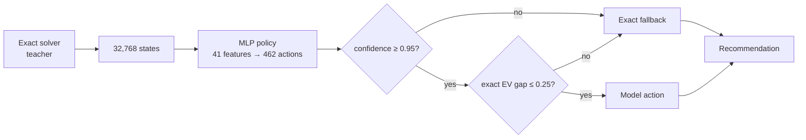

# 대학원 면접 발표안 — Yacht AI

> 기본 구성: 7분 발표, 본문 8장 + 선택 부록 3장 
> 제목의 `[지원 분야]`, 표지의 이름과 지원 대학원은 실제 정보로 교체한다. 
> 슬라이드에는 아래의 **화면 문구**만 넣고, 설명은 [발표 대본](./graduate-interview-script.md)으로 말한다.

---

## 1. Exact Solver를 기준선으로 활용한 안전한 학습 기반 Yacht 의사결정 시스템

### 화면 문구

**Exact Solver를 기준선으로 활용한 
안전한 학습 기반 Yacht 의사결정 시스템**

- 지원 분야: `[인공지능 / 소프트웨어 / 데이터사이언스]`
- 지원자: `[이름]`
- 핵심 질문: **모델의 정답률이 아니라 실제 의사결정 손실을 어떻게 측정하고 통제할 것인가?**

### 시각 구성

왼쪽에는 게임 화면 한 장, 오른쪽에는 핵심 질문만 크게 배치한다. 프로젝트 기능 목록은 넣지 않는다.

---

## 2. 문제 정의 — 확률 게임이 아니라 순차적 의사결정 문제

### 화면 문구

한 게임은 12턴이며, 매 턴 두 종류의 결정을 반복한다.

1. **Roll decision**: 어떤 주사위를 유지하고 다시 굴릴 것인가?
2. **Score decision**: 결과를 어느 점수 칸에 기록할 것인가?

상태와 목적:

\[
s=(\text{dice},\ \text{rolls left},\ \text{scorecard},\ \text{bonus state})
\]

\[
\pi^*=\arg\max_\pi \mathbb{E}[\text{final score}\mid s]
\]

**어려움:** 지금의 높은 점수와 Upper Bonus·남은 점수 칸의 장기 가치가 충돌한다.

### 시각 구성

`현재 주사위 → keep/reroll → 점수 칸 선택 → 다음 턴`의 짧은 순환 그림을 쓴다.

---

## 3. 기준선 — Exact Value로 행동의 장기 가치를 계산

### 화면 문구

**Exact Solver:** 가능한 모든 행동과 확률적 결과를 게임 규칙대로 계산해, 기대값이 가장 높은 행동을 고르는 프로그램

Bellman 형태로 각 행동의 장기 기대가치를 비교한다.

\[
Q^*(s,a)=\mathbb{E}\left[r(s,a)+V^*(s')\right],
\qquad V^*(s)=\max_a Q^*(s,a)
\]

- 남은 reroll: 가능한 keep와 주사위 결과를 exact tree/DP로 평가
- 점수 기록: 12개 점수 칸이 열린 상태까지 포함한 precomputed value table 사용
- 이론적 시작 상태 기대점수: **약 198.36점**

이 기준선으로 정책의 행동 손실을 직접 계산한다.

\[
\operatorname{regret}(s,a)=Q^*(s,a^*)-Q^*(s,a)
\]

### 시각 구성

주사위 `[2, 2, 3, 5, 6]`에서 2를 유지하는 행동과 전체 reroll 행동이 두 갈래로 나뉘고, 각 갈래 끝에 EV가 붙는 작은 decision tree를 그린다.

---

## 4. 제안 방법 — 모델은 대체재가 아니라 후보 생성기

### 화면 문구

설계 원칙:

- exact solver의 행동을 모방하도록 roll-stage MLP 학습
- confidence와 EV gap을 모두 통과한 경우에만 모델 행동 채택
- 불확실하거나 손실 가능성이 큰 상태는 exact solver로 fallback

### 시각 구성

위 흐름도만 크게 보여준다. 모델 구조의 세부 레이어는 질문이 있을 때 부록으로 설명한다.

---

## 5. 평가 설계 — Accuracy보다 Decision Regret

### 화면 문구

| 질문 | 지표 | 실험 설계 |
| --- | --- | --- |
| 행동을 얼마나 잘 골랐나? | Top-1 / Top-3 | held-out teacher split 6,554개 |
| 틀렸을 때 얼마나 손해인가? | **Decision regret** | exact \(Q^*\)와 행동별 비교 |
| 한 게임에서 실제 점수 차이는? | 평균 점수·승률·보너스율 | 동일 seed의 paired simulation |
| 서비스에서 감당 가능한가? | cold / warm latency | 6개 시나리오 반복 측정 |

통제:

- 동일 seed를 사용해 정책 간 주사위 운의 차이를 줄임
- 평균 차이에 95% CI와 paired test를 함께 보고
- `optimal` 정책의 regret이 0인지 평가기 자체를 검증

---

## 6. 결과 1 — 장기 가치를 쓰면 의사결정 손실이 감소

### 화면 문구

**Score-stage 교체 실험**

| 정책 | 평균 점수 | 평균 차이 | Upper Bonus | vs heuristic 승률 |
| --- | ---: | ---: | ---: | ---: |
| Heuristic | 175.52 | — | 42% | — |
| Exact score value | **184.56** | **+9.04** | **54%** | **58.5%** |

- 200 paired games, seed `20260708`
- 평균 차이 95% CI: **[+3.43, +14.65]**
- two-sided normal \(p=0.00159\)

**Decision regret 분해**

| 정책 | Regret / game | Roll match | Score match | Score regret |
| --- | ---: | ---: | ---: | ---: |
| Focused heuristic | 19.49 | 70.09% | 81.0% | 0.755 / decision |
| Exact score value | **10.39** | 70.11% | **100%** | **0.000 / decision** |

**해석:** roll 정책은 거의 그대로 두고 score-stage 손실만 제거했다.

### 시각 구성

표 대신 막대그래프를 쓸 경우 `175.52 → 184.56`과 `19.49 → 10.39` 두 쌍만 보여준다. 축은 반드시 0에서 시작한다.

---

## 7. 결과 2 — 높은 정확도만으로는 안전하지 않았다

### 화면 문구

| 검증 조건 | 채택 범위 | 정확도 | 추가 EV 손실 |
| --- | ---: | ---: | ---: |
| 학습 당시 held-out, raw | 100% | Top-1 **98.52%** | 평균 0.0237, 최대 10.15 |
| 최신 독립 표본, raw | 100% | Top-1 **81.59%** | 평균 **1.211**, 최대 **27.77** |
| 최신 독립 표본, guarded | **39.51%** | 채택 구간 **99.07%** | 평균 0.000031, 최대 0.125 |

발견한 hard case:

- 기존 split에서는 이미 완성된 강한 패에서 일부만 keep하는 rare error
- 최신 표본에서는 focused 초반 상태의 label drift와 과신 발견
- confidence `0.95`만 적용해도 정확도가 83.68%여서 exact gap guard가 필수

응답 시간:

- exact value cold: 시나리오 평균 **58.5–140.2 ms**
- cache warm: 시나리오 평균 **0.042–0.054 ms**

**결론:** 내부 held-out 98%만으로는 부족했다. 독립 검증에서 drift를 발견해 learned model을 비활성으로 유지했고, 최신 teacher로 재학습하기 전에는 배포하지 않는다.

**후속:** 최신 teacher 32,768개로 재학습한 v3는 같은 독립 표본에서 Top-1 94.04%, guard 채택률 52.60%로 회복했다. 하지만 model-only complete-game은 exact보다 12.18점 낮아, v3도 단독 배포하지 않고 staging 후보로만 유지한다. 자세한 수치: [v3 검증](./model-20260717-roll-policy-v3.md).

**정량 W/T/L:** indexed dice 200 paired games에서 v3 guard는 exact 대비 24승 / 161무 / 15패(Non-loss 92.5%, 평균 +1.59점, 95% CI -0.22~+3.40)였다. 이는 공정한 정책 비교이며 실제 온라인 대전 승률은 아니다.

---

## 8. 결론과 대학원에서 확장할 연구

### 화면 문구

### 이 프로젝트에서 확인한 것

1. exact solver로 학습·평가의 기준선을 만들었다.
2. 정확도를 **의사결정 regret**으로 확장해 오류의 비용을 측정했다.
3. confidence + EV guard + fallback으로 위험한 출력을 통제했다.

### 한계

- 200게임·고정 seed 실험은 더 큰 표본과 다양한 seed로 재검증 필요
- 검증 split의 EV gap 0은 일반화 보장이 아님
- 46.96%의 모델 채택률로 계산 절감 효과가 아직 제한적
- 점수 EV 최대화와 실제 상대 승률 최대화는 서로 다른 목적

### 다음 연구 질문

**정확성 보장을 유지하면서 exact 검증 비용과 fallback 비율을 함께 줄일 수 있는가?**

- uncertainty calibration과 selective prediction
- state distribution을 반영한 offline RL / self-play
- 상대와 점수차를 반영한 distribution-aware policy

---

# 선택 부록

## A1. 전체 정책 기준선

200 paired games, indexed random source, seed `20260708`:

| 정책 | 평균 점수 | vs heuristic | 승률 | Upper Bonus |
| --- | ---: | ---: | ---: | ---: |
| Heuristic | 168.195 | — | — | 23.5% |
| Exact score value | 182.600 | +14.405 | 63.0% | 43.0% |
| Full value-optimal | **198.645** | **+30.450** | **77.5%** | **66.0%** |

주의: 본문 6장의 score-stage 교체 실험은 stream random source, 이 표는 indexed random source다. 서로 다른 실험의 절대 평균을 직접 비교하지 않는다.

---

## A2. 모델과 재현 설정

| 항목 | 값 |
| --- | --- |
| Dataset | exact teacher states 32,768개 |
| Split | train 26,214 / validation 6,554 |
| Input | 41 features |
| Hidden dimension | 96 |
| Output | keep-count class 462개 |
| Training | 120 epochs, best epoch 107 |
| Runtime guard | confidence 0.95, EV gap 0.25 |

재현 스크립트와 요약 JSON은 저장소에 보관했다. 다만 최초 32,768개 teacher 원본은 현재 저장소에 없어 당시 held-out 결과를 완전히 재현할 수 없다는 한계가 있다. 이를 보완하기 위해 최신 solver와 별도 seed로 4,096개 독립 표본을 생성해 재검증했고, 생성 명령과 SHA-256을 [독립 검증 보고서](./model-validation-20260717.md)에 남겼다.

---

## A3. 구현 신뢰성

- Python test: **74 passed**
- Golden scenarios: **7 passed**
- Warm soak: **120 passed**
- Cold soak: **40 passed**
- Ruff lint, Python compile, frontend JavaScript syntax 검사 통과

연구 수치와 제품 동작을 분리해서 검증하며, 모든 결과는 원본 JSON report에서 다시 생성할 수 있다.

---

## 근거 자료

- [AI 품질 지표 정의](./ai-quality-metrics.md)
- [Decision regret 원본 해설](./decision-regret-100-value-score-only.md)
- [Score-stage paired 분석](./score-value-score-only-open12-focused-200-analysis.md)
- [Full value-optimal paired 분석](./score-value-full-table-optimal-focused-200-indexed-analysis.md)
- [Roll policy v2 평가](./model-20260630-roll-policy-v2.md)
- [Roll policy hard cases](./model-20260630-roll-policy-v2-hard-cases.md)
- [Roll policy 최신 독립 검증](./model-validation-20260717.md)
